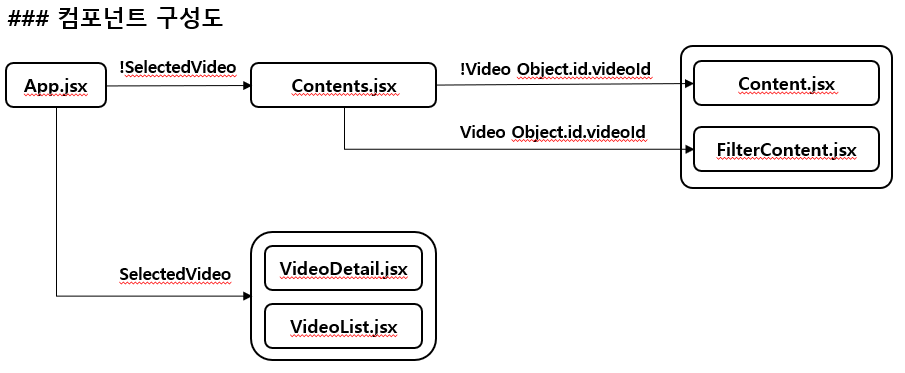
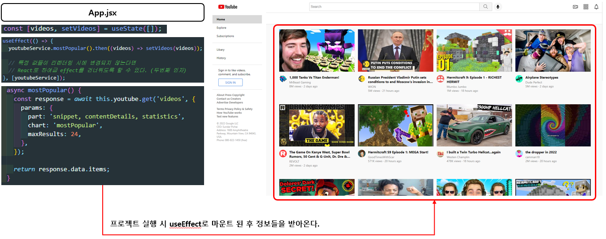
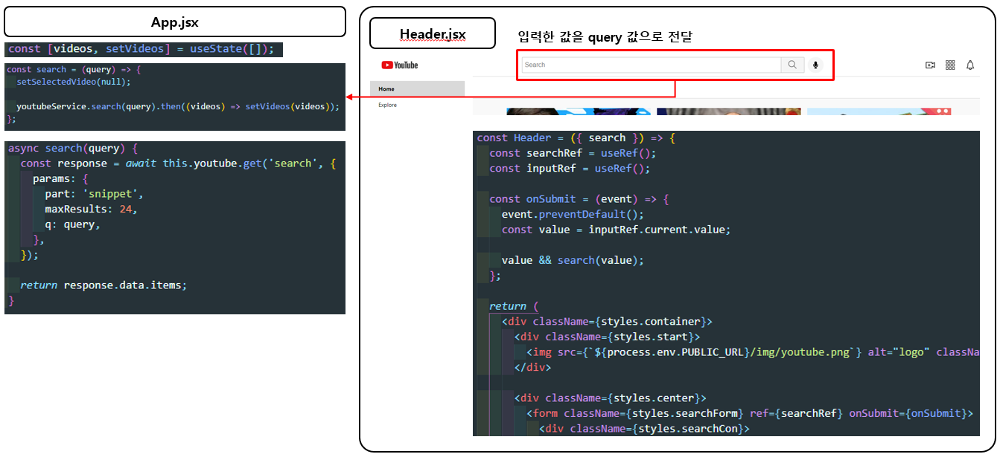
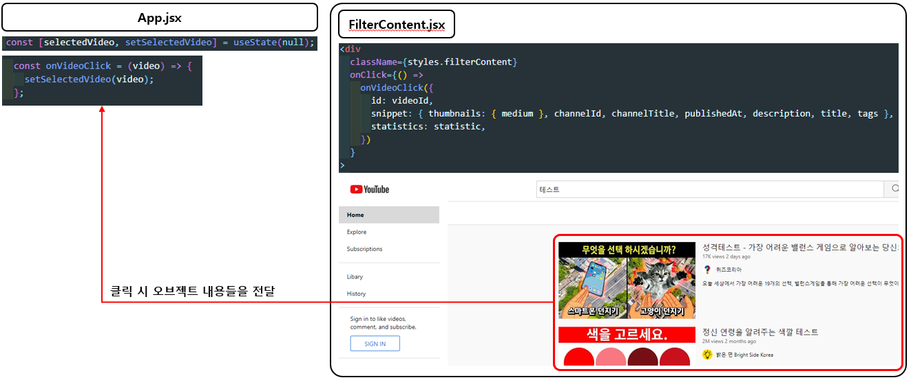
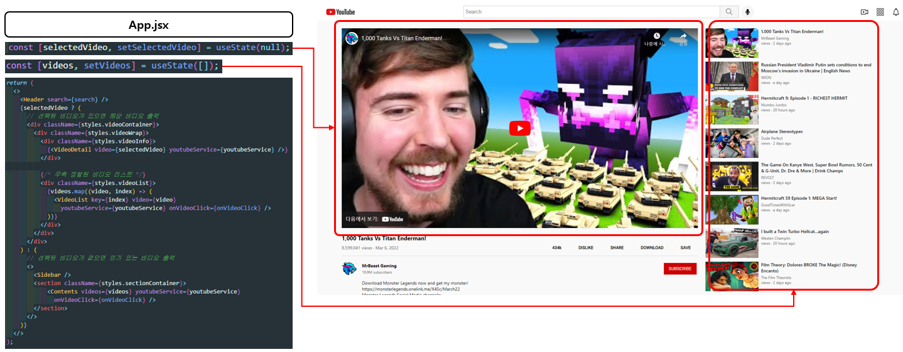

# 리액트를 활용한 YOUTUBE Clone Coding

## 📄 프로젝트 소개

유튜브에서 제공하는 YOUTUBE API를 활용해 간단하게 유튜브를 따라해 본 리액트 공부용 프로젝트로 간단한 기능들을 구현해 봤습니다.

이번 프로젝트는 리액트의 기능들을 사용해 보고 진행하면서 알게된 내용들을 노트에 간단히 정리하며 차근차근 단계별로 나아가는 것을 목표로 두고 시작했습니다 😀

## 📃 프로젝트 계획

### 구현 하고 싶은 기능 리스트

- 최대한 유뷰트와 비슷하게 구현
- 프로젝트 실행시 화면에 MostPopular 동영상 리스트 랜더링
- 라이트 모드, 다크 모드 구현
- 검색 기능 구현
- 반응형으로 구현

## 사용한 기술 ❗

### 💬Language

- HTML
- CSS
- Java Script
- React
- Post CSS

### 💬APIs

- YOUTUBE APIs

## 구현된 주요 기능 ❗

| 기능                      |                                 설명                                  |
| :------------------------ | :-------------------------------------------------------------------: |
| 가장 유명한 동영상 리스트 |        프로젝트 실행시 화면에 MostPopular 동영상 리스트 랜더링        |
| 검색                      |             영상 검색시 해당 영상 관련 리스트를 받아온다.             |
| 영상 디테일               | 리스트에서 클릭된 영상을 보여주고 관련된 정보를 디테일 하게 보여준다. |

## 💻 PC 화면

|                 화면 구성                  | 간단한 기능 설명                                         |
| :----------------------------------------: | -------------------------------------------------------- |
|   | 컴포넌트 구성도를 가단하게 나타낸 그림                   |
|  | 프로젝트 실행 시 화면이 랜더링 되는 과정                 |
|  | 랜더링 된 비디오를 클릭 시 데이터가 저장되는 과정        |
|  | 검색 시 랜더링 되는 과정                                 |
|  | 검색후 랜더링 된 비디오를 클릭 시 데이터가 저장되는 과정 |
|  | 선택된 비디오가 있을 시 렌더링 되는 과정                 |

## 🤪 어려웠던 부분/완성하지 못한 기능들

### 어려웠던 부분

- YOUTUBE를 Clone Coding을 하던 `SameSite`라는 오류가 자꾸 뜨는것을 발견했는데, 이 오류는 크롬 브라우저의 쿠키 정책이 바뀌게 되면서 생긴 것으로 쿠키의 속성중 `SameSite` 라는 속성이 Chrome 80 버전 부터는 아무 설정이 없으면 `Lax`를 기본으로 설정하게 된다고 하는데 이 부분의 오류를 해결하기 위해서 구글링을 많이 해봤지만 어느부분에 적용을 해야 하는지 이해할 수 없는 내용들이어서 조금 더 알아보고 해결해 봐야 할 것 같습니다.
   
- 영상들의 채널 아이콘, 영상 시간 등등의 디테일 한 정보들은 따로따로 받아와야 하는 부분에서 어려움을 굉장히 많이 느꼈습니다.  
  요청한 주소의 정보로 한번에 모든 데이터들을 갖고 오고 싶은데 제가 원하는대로 구현하지 못하는 점에서 많이 힘들었고 지금은 useEffect로 마운트시 갖고 오게끔 했지만 이 부분은 너무 돌려막기 같은 느낌이 강해 계속 수정해 나갈 예정 입니다.

### 완성하지 못한 기능들

- 다크 모드, 라이트 모드 구현
- 반응형으로 구현

## 😵 발견된 버그

- MostPopular 영상 클릭후 우측 영상 리스트 부분에서 영상 클릭시 statistics 정보가 없어 받아오지 못한다. (해결 가능)
